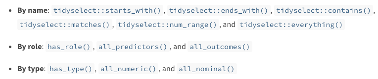

exclude: true

```{R, setup, include = F}
library(pacman)
p_load(
  broom, tidyverse,
  ggplot2, ggthemes, ggforce, ggridges, cowplot,
  latex2exp, viridis, extrafont, gridExtra,
  kableExtra, snakecase, janitor,
  DT, data.table, dplyr,
  lubridate, knitr, future, furrr,
  estimatr, FNN, parsnip,
  huxtable, here, magrittr, tidymodels, caret, party, recipes, workflows, glmnet, C5.0
)

library(tidymodels)
# Define colors
red_pink   = "#e64173"
turquoise  = "#20B2AA"
orange     = "#FFA500"
red        = "#fb6107"
blue       = "#3b3b9a"
green      = "#8bb174"
grey_light = "grey70"
grey_mid   = "grey50"
grey_dark  = "grey20"
purple     = "#6A5ACD"
slate      = "#314f4f"
# Knitr options
opts_chunk$set(
  comment = "#>",
  fig.align = "center",
  fig.height = 7,
  fig.width = 10.5,
  warning = F,
  message = F
)
opts_chunk$set(dev = "svg")
options(device = function(file, width, height) {
  svg(tempfile(), width = width, height = height)
})
options(knitr.table.format = "html")
```
---
class: inverse, middle
# Welcome to Parsnip

---
name: admin
# Welcome to Parsnip

## Why bother with Tidymodels?

- As Ed said: 
--
.hi-orange[ It's the future, Marty]

--
```{R, MARTY, echo = F, out.width = '60%'}
knitr::include_graphics('images/ec524-heart-disease.jpg')
```

No but really: it is extremely intuitive, and streamlines a lot of the annoying parts of data science (data cleaning, cross validation, mutliple model testing, etc.)

---
# Welcome to Parsnip

## Why bother with Tidymodels?

- Why use this over `caret()`?

--
 
Two reasons:
 
1.) It plays well with the tidyverse, and uses the very nice pipes system from dplyr
  
--
  
2.) It lets you quickly substitute in new parts to reuse old code - making your life a LOT simpler
  
--

But, to use `Parsnip` or `tidymodels`, you first have to have a good sense of the 'data science workflow' according to the makers


---
class: inverse, middle
# Workflow
---
name: admin
#Workflow

## Workflows

```{R, fig workflows, echo = F, out.width = '80%'}
knitr::include_graphics("images/Workflows.png")
```
.footnote[
.orange[*] Source: https://education.rstudio.com/blog/2020/02/conf20-intro-ml/.
]
---
name: parsnip
## Example with just parsnip

.hi-blue[Parsnip] lets us build a model much like Caret, but in the .hi-orange[smallest possible] building blocks.

These include, in order:

--

  - A model type. This is a broad category of model, like .hi[linear regression] or .hi-blue[classification tree].

--

  - An "engine." This is the package that will run the model type you provided above. This could be either `lm` or  `glmnet` for linear regression

--

  - A fit object. This fits the data to the model you built above
  
--

Let's do a worked example, using your homework data from the last project.


---
# Models with Parsnip

Let's read in the heart data, and then we can use the `parsnip()` package to run a simple regression

```{R, dataread, include = F, out.width = '80%'}
heart_data_tr = read_csv('./ec524-heart-disease/train.csv')
heart_data_ts = read_csv('./ec524-heart-disease/test.csv')
```

```{r, workflow}
#Let's build a model in steps
lazzo = linear_reg()
```
---
# Models with Parsnip

Let's read in the heart data, and then we can use the `parsnip()` package to run a simple regression

```{r}
#Let's build a model in steps
lazzo = linear_reg() %>% 
  set_engine('lm')
```


---
# Models with Parsnip

Let's read in the heart data, and then we can use the `parsnip()` package to run a simple regression

```{r}
#Let's build a model in steps
lazzo = linear_reg() %>% 
  set_engine('lm') %>% 
    parsnip::fit(
    heart_disease ~ sex + chest_pain + resting_bp, 
    data = heart_data_tr
    )

rez = predict(lazzo, new_data = heart_data_tr) %>% rename(lm = .pred)
mean((rez[[1]] %>% round() - heart_data_tr$heart_disease)^2, na.rm = T)
```

Not great. Maybe a lasso would help us? All that work again? 
--
.hi[No!]

---
# Models with Parsnip

I can just overwrite an engine/model and then rerun all of this with one simple update

```{r}
#build initial model
lazzo_mod = linear_reg() %>% 
  set_engine('lm') 
```

--

```{r}
#switch to lasso/ridge/elasticnet. We can set hyperparameters in 'set_args'
results=lazzo_mod %>% set_engine('glmnet') %>% 
  set_args(penalty = 0.001, mixture = 0.5) %>%
    parsnip::fit(
    heart_disease ~ sex + chest_pain + resting_bp, 
    data = heart_data_tr
    )

rez = predict(results, new_data = heart_data_tr)
mean((rez[[1]] %>% round() - heart_data_tr$heart_disease)^2, na.rm = T)
```
---
# Models with Parsnip

But, from your homework, you know you .hi[really] need to do this using classification methods. 
--
And that requires data cleaning, to at the very least get some factors built. 
--
.hi-orange[Ugh]

--

That's where `recipes()` is going to save the day.

But - quickly, we need to revisit our workflow diagram, because we're going to organize everything according to a .hi[workflow] object. 
--
Yup, that's a package too

---
#Workflows()

```{R, fig workflows2, echo = F, out.width = '80%'}
knitr::include_graphics("images/Workflows.png")
```
.footnote[
.orange[*] Source: https://education.rstudio.com/blog/2020/02/conf20-intro-ml/.
]

---
class: inverse, middle
# Improving your workflow with workflow

---
# Improving your workflow with workflow

Using workflow is quite simple. You just make a `workflow()` object, and tack on steps using a `%>%`.

```{r}
#workflow always starts with workflow
my_big_tuna = workflow()
```


---
# Improving your workflow with workflow

Using workflow is quite simple. You just make a `workflow()` object, and tack on steps using a `%>%`.

```{r}
#let's use a formula to tell our model what to do
my_big_tuna %<>% add_formula(heart_disease ~ sex + chest_pain + resting_bp)
```


---
# Improving your workflow with workflow

Using workflow is quite simple. You just make a `workflow()` object, and tack on steps using a `%>%`.

```{r}
#now we can add a parsnip model from before onto our workflow to predict some stuff
my_big_tuna %<>% add_model(lazzo_mod)
```

---
# Improving your workflow with workflow

Using workflow is quite simple. You just make a `workflow()` object, and tack on steps using a `%>%`.

```{r}
#now we can just pass this thing to fit, and get our fitted object back.
parsnip::fit(my_big_tuna, data = heart_data_tr)
```


---
# Improving your workflow with workflow

Oh oops. That was an `lm()` model. We might want our `glmnet` back. Ok, no problem

--

```{r}
#Just create a new model
real_lazzo = lazzo_mod %>% 
  set_engine('glmnet') %>% 
  set_args(penalty = 0.001, mixture = 0.5)
```

```{r}
#...and update our workflow accordingly
my_big_tuna %<>% update_model(real_lazzo)
parsnip::fit(my_big_tuna, data = heart_data_tr) %>% 
  predict(heart_data_tr) %>% 
  rmse(estimate = .[[1]], 
       truth = heart_data_tr$heart_disease)
```

--

Right... back to `recipes`

---
class: inverse, middle
# Recipes


---
#Recipes

## Imagine You are baking muffins...

The idea behind recipes is to treat .hi-orange[data processing] and .hi-blue[model building] as an understandable process (.hi[recipe]) for a program to follow to 'bake' your predictions into the model you want.

--

- .hi-blue[Step 1:] Separate your ingredients: tell your program what variables are which. This is done using formula and model objects

--

- .hi-orange[Step 2:] Provide a list of directions to mix your ingredients (change them) in order.

--

- .hi-orange[Step 3:] Prep your data using your instructions (mixing the recipe)

Recipes essentially act like super sophisticated .hi-orange[formulae] objects, and let you tell your model how it needs to treat any new data it sees.

---
#Recipes

## Example

If you recall, we don't want to use ID to do our predicting! Maybe we could keep that variable, and exclude it from all of our data cleaning, but still hold onto it in our data frame... Yup. We can do that.

--

`Recipes` uses .hi-orange[roles] to separate your .hi-blue[ingredients (variables)] into separate buckets. 
--

I'll give in and use the baking analogy: you don't want to sift your eggs and beat your salt. 

--

First though - here's an adorable graphic.

---
#Recipe
```{r, a-dora-ble, echo = F}
knitr::include_graphics('images/socute.png')
```

.footnote[
.orange[*] Source: https://education.rstudio.com/blog/2020/02/conf20-intro-ml/.
]
---
#Recipe

A recipe begins its life, usually, as a formula object that takes some information from our data.

--

Let's make one and see what it looks like

```{r}
hd_recipe = recipe(heart_disease ~ ., data = heart_data_tr) 

hd_recipe %>% summary() %>% head(3)
```

---
#Recipe

## Roles

We can change or add roles (variables can have multiple) by either `update_role` or `add_role`

```{r, eval = F}
hd_recipe %<>% 
  update_role(id, new_role = 'id_variables') %>% 
  add_role(sex, exercise_angina, high_sugar, chest_pain, 
           slope, vessels, thalium_scan, ecg, new_role = 'sneaky_dummies')
```

---
# Recipes

## Now what?

Ok, this might not seem useful to you... .hi[but just wait.] We are essentially creating different 'dry ingredients/wet ingredients' shelves in our cabinet so we can tell R to treat them differently in preprocessing (or for another reason.)

--

 - Let's do our preprocessing using this recipe analogy. We can use what are called .hi[selectors] to pick and choose what variables to transform and how. Here's a brief snapshot of some of them that are available


---
# Recipes

```{r, selectors, echo = F, out.width = '80%'}

```

These then get passed to .hi-orange['step_*'] methods, of which there are a TON. The cool thing is, is that these roughly follow the naming convention:

step_
--
your_friendly_preProcess_method_from_caret()

--

Let's see these in action

---
#Recipes

 - We want to build our preprocessing as if we were writing a recipe for someone else to replicate, using a series of steps.
 
```{r, step 1}
hd_recipe %<>% step_mutate_at(has_role('sneaky_dummies'),
                              -all_outcomes(), fn = as.factor)
```

---
#Recipes

 - We want to build our preprocessing as if we were writing a recipe for someone else to replicate, using a series of steps.
 
```{r, echo = F}
rm(hd_recipe)

hd_recipe = recipe(heart_disease ~ ., data = heart_data_tr) 

hd_recipe %<>% 
  update_role(id, new_role = 'id_variables') %>% 
  add_role(sex, exercise_angina, high_sugar, chest_pain, 
           slope, vessels, thalium_scan, ecg, new_role = 'sneaky_dummies')
```

 
```{r, step 1.2}
hd_recipe %<>% step_mutate_at(has_role('sneaky_dummies'), 
                              fn = as.factor) %>%
  step_center(all_predictors(), 
                           -all_nominal()) 
```

---
#Recipes

 - We want to build our preprocessing as if we were writing a recipe for someone else to replicate, using a series of steps.
 
```{r, echo = F}
rm(hd_recipe)
hd_recipe = recipe(heart_disease ~ ., data = heart_data_tr) 

hd_recipe %<>% 
  update_role(id, new_role = 'id_variables') %>% 
  add_role(sex, exercise_angina, high_sugar, chest_pain, 
           slope, vessels, thalium_scan, ecg, heart_disease, new_role = 'sneaky_dummies')
```
 
```{r, step 1.3}
hd_recipe %<>% step_mutate_at(has_role('sneaky_dummies')
                              , fn = as.factor) %>%
  step_center(all_predictors(), 
                           -all_nominal())  %>% 
  step_scale(all_predictors(), -all_nominal()) %>%
  step_nzv(all_predictors()) %>% step_mutate_at(all_outcomes(), fn = as.factor)
```

---
#Recipes
However, we probably also want to do imputation on our data. Let's do that too.

```{r}
hd_recipe %<>% step_medianimpute(all_numeric()) %>% step_modeimpute(all_nominal())
```

Great, we have done a ton of...
--

.hi-orange[what?]

--

- We've now given a set of directions to follow when we train a model.

--

- what model?

--
Any model we want, so long as we are using the data cleaning process we just described. 

---
# Recipes

## Training preprocessing?

Before we do anything more, we actually have to set up our ingredients in our shelves. This is what `prep()` does.

--

```{r}
prepped_recipe = prep(hd_recipe)
```
--

Why do we need to train a preprocessing step, you might ask?

--

.hi[So we can use the SAME process to transform any dataset we like]

- for instance, our testing data.

---
# Recipes

```{r}
heart_data_ts$heart_disease = -2
bake(prepped_recipe, new_data = heart_data_ts) %>% head(2)
```

---
#Recipes

## Getting the data out of the tidymodels sphere

Now, if we're just interested in the training data, we can actually get the transformed data using the `juice` function. I'll show you that in a second.

--

- Think of `juice()` as .hi[bake light]

--

.hi[Let's bring this all together]
---


#Tidymodel process

Just like with our model object, we can pass our recipe object to the workflow directly, in place of the formula we had before.

```{r}
#Classification tree?
ctree_mod = decision_tree() %>% set_engine('rpart') %>% 
  set_args(min_n = 8) %>% 
  set_mode('classification')

my_big_tuna = workflow() %>% 
  add_recipe(hd_recipe) %>% add_model(ctree_mod)

```
---
#Tidymodel process

Now, we can just fit this data here! We can use 'Juice' to get our heart disease variable, and then put both our predictions and passed values in a ROC curve.

```{r}
#Classification tree?
truths = as.factor(heart_data_tr$heart_disease)

hdpred = parsnip::fit(my_big_tuna,
      data = heart_data_tr) %>% 
  predict(new_data = heart_data_tr, 'prob') %>% 
  mutate(true_pred = truths,
         pred = as.numeric(.pred_1))
```
---
#Tidymodel process

```{r, out.width= '80%'}
roc_curve(hdpred, truth = true_pred, estimate = pred) %>% 
  autoplot()
```


---
#Tidymodel process

With all this in place though, where's the upside?

--

.hi[We can swap models, recipes, formulas, dataset and steps without rewriting code]


```{r}
#Random Forest?
rfmod = rand_forest() %>% set_engine('ranger') %>% 
  set_args(min_n = 8, trees = 10000, mtry = 6) %>% 
  set_mode('classification')

my_big_tuna  %<>% update_model(rfmod)
```

---
#Tidymodel process

Now just refit/repredict and...

--

```{r}
hdpred = parsnip::fit(my_big_tuna,
      data = heart_data_tr) %>% predict(new_data = heart_data_tr, 'prob') %>% 
  mutate(true_pred = (prepped_recipe %>% juice())$heart_disease %>% 
           as.numeric() %>% as.factor(),
         pred = as.numeric(.pred_1))
```
---
#Tidymodel process

```{r, out.width= '80%'}
roc_curve(hdpred, truth = true_pred, estimate = pred) %>% autoplot()
```

---
#Tidymodel process

But we're missing one key ingredient... 
--
.hi-orange[cross validation]

--

 - You've likely noticed that everything I've done so far has been only .hi-blue[in sample]
 
--
 
 - That's because to do cross validation, we need to know how to create splits

 - that's where `rsample` comes in.
 
---
class: inverse, middle
# Cross Validation in tidymodels 


