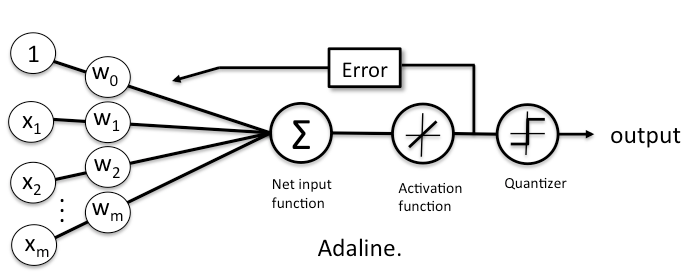
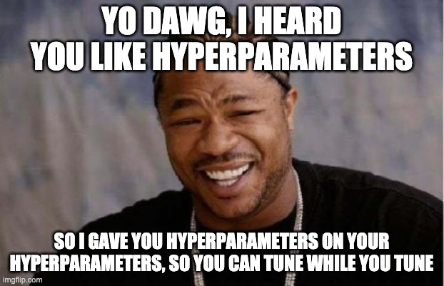
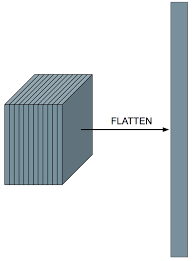
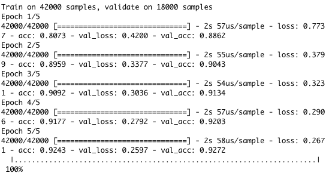
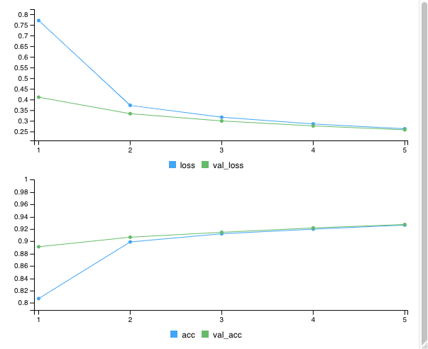
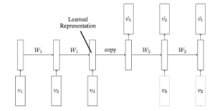
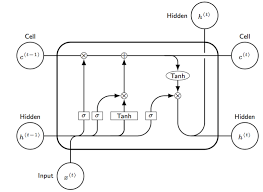

exclude: true

```{R, setup, include = F}
library(pacman)
p_load(
  broom, tidyverse,
  ggplot2, ggthemes, ggforce, ggridges, cowplot,
  latex2exp, viridis, extrafont, gridExtra,
  kableExtra, snakecase, janitor,
  DT, data.table, dplyr,
  lubridate, knitr, future, furrr,
  estimatr, FNN, parsnip,
  huxtable, here, magrittr, tidymodels, caret, party, recipes, workflows, glmnet, C5.0, tensorflow, keras
)

library(tidymodels)
# Define colors
red_pink   = "#e64173"
turquoise  = "#20B2AA"
orange     = "#FFA500"
red        = "#fb6107"
blue       = "#3b3b9a"
green      = "#8bb174"
grey_light = "grey70"
grey_mid   = "grey50"
grey_dark  = "grey20"
purple     = "#6A5ACD"
slate      = "#314f4f"
# Knitr options
opts_chunk$set(
  comment = "#>",
  fig.align = "center",
  fig.height = 7,
  fig.width = 10.5,
  warning = F,
  message = F
)
opts_chunk$set(dev = "svg")
options(device = function(file, width, height) {
  svg(tempfile(), width = width, height = height)
})
options(knitr.table.format = "html")
```

---
class: inverse, middle
# Deep Learning and Neural Nets

---

# Why so exciting?

- Aside from having a name that sounds like it came straight out of Neuromancer, why is everyone so excited about Neural Networks?

--

- Imagine trying to map a complex pattern to some outcome. Maybe you're trying to recognize whether an image is a dog, or a blueberry muffin.

--
```{R, echo = F, out.width = '30%'}
knitr::include_graphics('images/dogmuff.jpeg')
```


---

# Why so exciting?

```{R, echo = F, out.width = '30%'}
knitr::include_graphics('images/dogmuff.jpeg')
```

 - How do we find the dog/muffin functional form? 
--
What kind of expert dog-ology field can we turn to in order to solve our problem? 

--

- However, .hi-orange[you] can recognize which is which, right?

--

Have you taken a course in dog-ology? 
--
.hi[Probably not.]

---
#Why so exciting?

You've seen dogs, you've seen muffins, and somehow your brain has found an unknown way to tell the difference. What about letters/numbers?

--

```{r, echo = F, out.width = '50%'}
knitr::include_graphics('images/mnist_gen.png')
```


--

That's what neural networks are trying to imitate - that process of taking one set of sensory inputs, and through repetition, finding patterns that map to some .hi[internal] set of labels. 
--
But, in order to understand neural networks, we should do a little foundational history on them.

---
name: admin
# The building block: perceptron

## Where did the first 'neural network' come from

- Neural networks (in their most basic form) are actually one of the oldest (if not THE oldest) machine learning tool still in use today.

--

- Invented by McCulloch and Pitts in 1943.orange[*], the perceptron (the most fundamental element of a neural network) conceptually predate Alan Turing's machine. 

.footnote[
.orange[*] McCulloch, W. S. and Pitts, W. 1943. A logical calculus of the ideas immanent in nervous activity. Bulletin of Mathematical Biophysics 5:115–133..
]

--

You might ask yourself, why would anyone bother with designing an algorithm that takes hours of compute time on a high-end machine .hi[TODAY] when at the time, they lacked even a rudimentary computer?

--
The intent was to build a model of a single neuron.

---
name: admin
# The building block: perceptron

In order to understand how the intuition for how a perceptron works mathematically, having a basic understanding of the .hi[biological mechanics] of a neuron is useful.

--

```{r, echo = F, out.width = '60%'}
knitr::include_graphics('images/neuron.png')
```

.footnote[
.orange[*] Source: wikipedia. No, they didn't endorse my usage of this diagram.
]

---
name: admin
# The building block: perceptron

In order to understand how the intuition for how a perceptron works mathematically, having a basic understanding of the .hi[biological mechanics] of a neuron is useful.


```{r, echo = F, out.width = '60%'}
knitr::include_graphics('images/Neuron_diagram.png')
```

.footnote[
.orange[*] Source: wikipedia. No, they didn't endorse my usage of this diagram.

.blue[*] Moar JPEG
]

---
name: admin
# The building block: perceptron

Ok, so how do we model this process using only the mathematical tools we have available?


--

 - We need a function that takes a .hi[consistent] set of inputs and maps them efficiently to some (potentially unknown) outputs.

 
 
--


- Let's start by simplifying the problem, and only modeling 'activated/not activated' once some .hi-orange[threshold] of charge is reached.

--


```{r, equation, echo = F}
eq = noquote(paste(expression("1, & \\text{if} \\sum_{k=1}^N x_k > \\Theta \\newline
  0, & \\text{otherwise}")))
```
---
# Perceptron, formally

.hi[Rules]

1. $$output = y \in \{0,1\}$$

2. $$inputs = x_n \in \{0,1\},\ and \ |X| = N $$

3. $$Threshold\ value = \Theta $$

4. $$\sigma(X) = 1 \  if \sum_{k=1}^N x_k > \Theta, \ else = 0$$


---
# Perceptron, formally

.hi-orange[Put another way:]

--

We're going to:

--

- take Xs (inputs), multiply each $x_i$ by a weight $w_i$.hi-orange[*], and then scale that value from 0-1, using a step function where $\sum_i w_i = \Theta$ 

.footnote[
.orange[*] This was a slight modification by Frank Rosenblatt who built the first computer-based perceptron
]
--
```{r, echo = F, out.width = '60%'}
knitr::include_graphics('images/arti_neuron.png')
```

--
Now, we're going to make a .hi[minor] change

---
# Perceptron, formally

```{r, echo = F, out.width = '60%'}

```


--

Two things to notice:

--

- we now have an activation function that replaces $\Theta$.

--

- .hi[T?] Why is that there? That's an in-built assumption that learning takes .hi[time]. It also is critical in how we go about solving this thing.

---
# Perceptron, how do they work?

- You might have wondered: how in the world do we solve this thing?

--

- The answer: 
--
.hi[we guess.] We start with some random set of weights.

--

- Then we update, using information from our accuracy to infer how well our weights are informing those guesses. Eventually, we'll get something meaningful

--

- This is why the change from the original step-wise function is so important: 

--

.hi[The linear activation function] buys us something that the simple step-wise function could not:

--
.hi-orange[differentiability.]

--

- This means we can identify some cost function and attempt to identify a method to minimize that cost function - using the derivative $\frac{\partial{L}}{\partial{w^t_i}}$ to update the weights from $w^t_i$ to $w^{t+1}_i$.

---
# Perceptron, how do they work?

Lucky for us, we can define $\frac{1}{2}*SSE$ as our loss function, and then $\frac{\partial{L}}{\partial{w^t_i}}$ is fairly easy.

for each training sample... in each iteration

--

**1.)** $z = w^t_0 + w^t_1x_1 \dots w^t_nx_n = (W^t)^Tx.$ 

$w^t_0\ \text{is a scalar (bias). You will sometimes see this as}\ b^t$

--

**2.)** $\phi(z^{(i)}) = \widehat{y}^{(i)}$

--

**3.)** $\eta = \text{learning rate}$

--

Loss function: $J(w_i^t) =\frac{1}{2}\sum_i(y^{(i)}-\phi(z)^{(i)})^2$

--

$\frac{\partial{J}}{\partial{w^t_j}} = - \sum(y^{(i)} - \phi(z)^{(i)})x^{(i)}_j$

$W^{t+1} = W^t - \eta \nabla J(W^t)$

---
# Perceptron, how do they work?

Let's see this in action:

--
<center>

Source: Reddit
</center>

---
# Perceptron, how do they work?

You'll notice that the linear 'activation function' produces a linear decision boundary.

--

- So what's the .hi-orange[big deal?] We could do that, and more, with SVMs.

--

- Unlike with SVM, perceptrons .hi-orange[improve over time.] 
--
Because a perceptron can hypothetically continue to improve so long as it keeps seeing any loss, the only upper limit to a perceptron's performance is how flexible the activation function is.

--

But there's more than that: because we're using derivatives to update the weights, we can link a bunch of neurons together and use .hi-red[the chain rule] to optimize the model weights $W$ as they .hi[work together] to find the pattern that maps $X \to Y$.

--

Well what do you get when you glue a bunch of neurons together? 
--
.hi[A brain!].hi-orange[*] 


---
# Neural Networks

By breaking down a complex mapping task into a series of steps, we can use large collections of modified perceptrons to universally approximate .hi-orange[any] functional form.

--

- You .hi[already] know how to do this.orange[*], you can extend the model yourself!

.footnote[
.orange[*] with a liiitle more calculus
]

--

- Imagine making several perceptrons that each learn patterns in parallel that simultaneously are trying to minimize your loss function. 
--
These are called .hi-blue[layers]

---
#Layer Gif

<center>

</center>

Source: Imperial College

---
#Layer?

<center>

</center>

.hi[Layer] seems to imply we could have multiple sets of perceptrons?

--

- .hi-orange[We can!]

--

All we do is make the $y_0,\ y_1,\ y_2$ feed into a .hi[new] set of perceptrons and have those new perceptrons find the .hi-blue[patterns] in the output of our old ones.

--

that makes the output a little more complex, because now $\widehat{y}$ is equal to $\sigma_2(\sigma_1(X))$

--

Where $\sigma_i()$ is the perceptron weighting and activation function for layer .hi[i]

---
#Visualizing a Neural Network

```{r, echo = F, out.width = '80%'}
knitr::include_graphics("images/neural_net_diagram.png")
```

---
# Backpropagation

.hi-orange[How] do we update our weights using this new function? The main difference is that we need a way of creating an .hi[error] for EVERY layer. This requires...

--

 - .hi-red[the chain rule] (the scariest of rules)
 
$$F'(g(x)) = f'(g(x))g'(x)$$
 
--

For the output layer, we can define our error $(\delta^L_j)$ by

$$\delta^L_j = \frac{\partial{C}}{\partial{a^L_j}}\sigma'(z^L_j)$$

--

We can compute everything in here

---
#Backpropagation

$$\delta^L_j = \frac{\partial{C}}{\partial{a^L_j}}\sigma'(z^L_j)$$

$\frac{\partial{C}}{\partial{a^L_j}} = (a^L_j - y_j)$ (for .hi[our] cost function)

--

we already have $z^L_j$, and plugging it into $\sigma'$ is not difficult. The vector form of this is...

$\delta^L = (a^L - y) \circ \sigma'(z^L)$

Which we can also compute.
---
#Backpropagation

Now all that's left is to find the derivatives for the .hi[other layer errors] - however, those are going to be functions of the output error- let's look at some arbitrary layer $l \in \{1,\dots, L\}$ where $l$ is the layer before $l + 1$

$$\delta^l = ((w^{l+1})^T\delta^{l+1}) \circ \sigma'(z^l)$$

Where $w^{l+1} \equiv \text{weight matrix for layer }l+1$  

--

Now, we can use what we found to calculate $\delta^L$, which can be plugged in to find $\delta^{L-1}$ and so on, until we reach the first layer.

--

But what we really need is $\frac{\partial{C}}{\partial{w^l_j}}$ to update the weights.

---
#Backpropagation

In order to update the weights, we really need to know how our costs are changing as a result of our chosen weights.  This is actually super simple to do given what we already know:

 - $\frac{\partial{C}}{\partial{w^l_{j,k}}} = a^{l-1}_k\delta^l_j$

Or,

--

 - $\frac{\partial{C}}{\partial{w^l}} = a_{input}\delta^l_{output}$

Where $a_{input}$ is the .hi[input] to the weight for layer $l$ and $\delta_{output}$ is the .hi-orange[error of the output] from the weight $w^l$

--

Thus, the MSE for the guess $\widehat{y}$ of $y$ will trickle through the weights and update them as the algorithm learns. 
--
The error from the output trickles .hi[back] through the layers, .hi-orange[propagating] changes across all the weights at once

---
#Backpropagation

Let's see this in action:

<center>

</center>

.footnote[
.orange[*] Source: Medium.com
]

---
# Your errors

You can think of this process as finding the .hi[bottom of a bowl] by rolling a ball (with no momentum) down the side of it. The method we used before is called .hi[gradient descent], but there are others (we'll see those later.)

--

As the ball gets close to the bottom of the bowl, it will slow down and eventually stop at the lowest point.

--

 - Let's look at how gradient descent finds its way to the optimal point:

<center>

</center>

---
#Other Elements

Unlike other machine learning models we've seen so far, Neural Networks learn over what are called .hi-orange[epochs.]

--

- .hi-orange[dfn] Epoch: One full pass of the model over your training data set (updating the weights for each pass)

--

- They do this because they can still learn from data they have already seen before, so long as the network output has a non-zero error and they haven't reached the optimization point for the data they've seen.

Let's watch some neural networks .hi[do their thing.] Go here and play around with the tensorflow app: <a href = 'https://playground.tensorflow.org/#activation=tanh&batchSize=10&dataset=circle&regDataset=reg-plane&learningRate=0.03&regularizationRate=0&noise=0&networkShape=4,2&seed=0.25898&showTestData=false&discretize=false&percTrainData=50&x=true&y=true&xTimesY=false&xSquared=false&ySquared=false&cosX=false&sinX=false&cosY=false&sinY=false&collectStats=false&problem=classification&initZero=false&hideText=false'>playground</a>.

- Check out the spiral to see the 'hardest' pattern to fit.
---
# Some pitfalls of neural networks

- They are extremely flexible - and as we know already, that means they are prone to .hi[overfitting.] Even more so than the algorithms you've seen so far.

--

- They also have a ton of components to consider. You have an activation function to choose, you have a number of layers, you have the number of nodes .hi[IN] those layers...

---
#Some pitfalls of  neural networks

```{r, echo = F}

```

---
#Some pitfalls of neural networks

- this makes cross-validation much more difficult. They are much more reliant on either guessing and checking (.hi[bad]) or having experience with them (.hi-orange[better]).

--

- Further, because they climb to an optimum, there's no guarantee that the solution you find is the .hi[best] one you could have found for your data. It's highly dependent on how you're updating your weights (.hi-orange[optimization method]) and where you started.

--

How we've updated our weights so far has used something called .hi[gradient descent].

--

These two reasons are why the methods often used to minimize a cost function are .hi[super bizarre.]

---
#Common Optimization Techniques

 An example, .hi[Stochastic Gradient Descent]: 
 --
Rather than calculate the error across all points in the sample, only calculate the error for a single point at a time to speed up the process and avoid overfit/getting stuck at the same time.

Let's see how some of these weird functions act next to gradient descent .hi-red[red ball.]

--

<center>

</center>

---
#Programming a Neural Network

It is perfectly possible to code a neural network by hand, but by far the most common tool used to write neural networks for production is to use .hi[Tensorflow] and .hi-orange[keras.]

--

The main downside of these is that they're both written under the hood in python, which means it may take some wrangling to get tensorflow for Rstudio to work on your computer.

--

Both of these work together and use a strange representation of data called a 'tensor'. 
--
I don't have enough time to explain what a tensor is, but luckily this adorable human does a much better job than I ever could: <a href = 'https://www.youtube.com/watch?v=f5liqUk0ZTw'> tensors </a>

--

.hi[Tensorflow] lets us build a model sequentially, layer by layer. This is very similar to how tidymodels lets you build your data process.

---
#Tensorflow & Keras

<<<<<<< HEAD
.hi[Tensorflow] works by letting developers create **dataflow graphs** which describe how data moves through a series of processing nodes.
=======
.hi[Tensorflow] works by letting developersa create **dataflow graphs** which describe how data moves through a series of processing nodes.
>>>>>>> 2dfdd3df5961e0023c12c7635e0b7ace2cc03e70

--

This is a little different from Tidymodels - Tidymodels splits the processing steps up into different 'tasks' and then allows you to map each task to one another. .hi[Tensorflow] has only a single task.

--

Though Tensorflow is written to be accessed by .hi-orange[Python], it's really written in .hi-blue[C++].

--

The main advantage for tensorflow though is the same as for tidymodels - rather than having to know how the models work in detail, you can implement algorithms in abstraction.

--

Lastly - one weird aspect of tensorflow/keras is that even with random seeding, the results generated on two computers can be different. There aren't good ways to produce deterministic results.

---
#Tensorflow & Keras

Like in .hi-orange[tidymodels], .hi[tensorflow] starts with a model-type object. 
--
For our purposes, this is `keras_model_sequential()`.

--

This tells tensorflow we're going to build our neural network sequentially. 

--

Just like .hi-orange[parsnip], we build an abstration of a model that will be fed data to train on later.
---
#MNIST dataset

First, let's remind ourselves what our neural network is trying to do:

--

- We want our neural network to read .hi[handwritten numbers] and tell us what number they are .hi[supposed] to represent.

--

Just like with all machine learning, we need to really understand our data to do a good job predicting. Let's take a closer look at one observation in our dataset.

---
#MNIST dataset

```{r, eval = F}
mnist <- dataset_mnist()

mnist$train$x
```
```{r, echo = F}
mnist <- dataset_mnist()
```

 - .hi[WOOOO] that was a bad idea. Here's an illustration of what each $x_i$ looks like:
 
```{r, echo = F, out.width = '50%'}
knitr::include_graphics('images/mnistdat.png')
```
 
---
#MNIST data

You don't trust me, fine. We can look at our stuff too.

```{r, echo = F, fig.height = 3, fig.width = 5}
train_images <- mnist$train$x
image_1 <- as.data.frame(train_images[1, , ])
colnames(image_1) <- seq_len(ncol(image_1))
image_1$y <- seq_len(nrow(image_1))
image_1 <- gather(image_1, "x", "value", -y)
image_1$x <- as.integer(image_1$x)

ggplot(image_1, aes(x = x, y = y, fill = value)) +
  geom_tile() +
  scale_fill_gradient(low = "white", high = "black", na.value = NA) +
  scale_y_reverse() +
  theme_minimal() +
  theme(panel.grid = element_blank())   +
  theme(aspect.ratio = .5) +
  xlab("") +
  ylab("")
```
---
#MNIST data

How about the first 25

```{r, echo = F, fig.height = 4, fig.width = 4}
train_labels = mnist$train$y
class_names = c('zero', 'one', 'two', 'three', 'four', 'five', 'six', 'seven', 'eight', 'nine')
par(mfcol=c(5,5))
par(mar=c(0, 0, 1.5, 0), xaxs='i', yaxs='i')
for (i in 1:25) { 
  img <- train_images[i, , ]
  img <- t(apply(img, 2, rev)) 
  image(1:28, 1:28, img, col = gray((0:255)/255), xaxt = 'n', yaxt = 'n',
        main = paste(class_names[train_labels[i] + 1]))
}
```

---
#MNIST

Ok, that's great, but remember we need to set up this problem so we can turn a picture into an outcome (the numbers 0-9). How do we do it?

--

Well, we can squish the data so that each of these matrices in just a very long row of Xs. (28*28 = 784 different variables.)

--

```{r, echo = F, out.width = '20%'}

```

In practice, we can do this with color images as well, with each RGB value acting as a different pixel score.

---
#Tensorflow & Keras

Ok- let's do this in order.

```{r, tensorflow}
model <- keras_model_sequential()
```

---
#Tensorflow & Keras

Ok- let's do this in order.

```{r, tensorflow1.5}
model <- keras_model_sequential() %>%
  layer_flatten(input_shape = c(28,28))
```

--

This layer takes our 28x28 pixel image and flatttens it into a vector so the model can read it. Think of this like a recipe step.

---
#Tensorflow & Keras

Ok- let's do this in order.

```{r, tensorflow2}
model <- keras_model_sequential() %>%
  layer_flatten(input_shape = c(28,28)) %>%
  layer_dense(units = 128, activation = "relu")
```

--

This is our first layer in our Neural network! It creates 128 different 'neurons' (or perceptrons) and sets their activation function to be a relu. 

--

- What's a relu? It stands for: .hi[Re]ctified .hi[L]inear .hi[U]nit. It's all the rage these days, but it is super simple:
$$ReLU(X) = max(0, X)$$
```{r, echo = F, out.width = '28%'}
knitr::include_graphics('images/relu.png')
```

---
#Tensorflow & Keras

Ok- let's do this in order.

```{r, tensorflow3}
model <- keras_model_sequential() %>%
  layer_flatten(input_shape = c(28,28)) %>%
  layer_dense(units = 128, activation = "relu", name= 'hiddenlayer') %>%
  layer_dense(10, activation = "softmax", name = 'outputlayer')
```

--

This is our output layer, and the activation it's using is simply - "classify this into one of 10 (number of nodes) classes, and guess the one with the largest probability."

--

And that's a neural network! I gave the layers names, because it will be easier to see what they do if I come back later. How do I do that?

---
#Tensorflow & Keras

```{r}
summary(model)
```

you can see how many parameters they have and check - it should be $784\text{(28pix*28pix)}*128\text{(number of hidden neurons)} + 128(w_0 \ or \ b) = 100,480$

---
#Tensorflow & Keras
you can see how many parameters they have and check - it should be $784\text{(28pix*28pix)}*128\text{(number of hidden neurons)} + 128(w_0 \ or \ b) = 100,480$

--

That is what's called a:

--

 - .hi[dfn, Shitload:] A lot.
 
of parameters.

---
#Tensorflow & Keras

Now we need to .hi[prepare] the model.

--

This is done with a `compile` command. We need to give that command a loss function to use, an optimizer (we'll use stochastic gradient descent (**sgd** in tensorflow) which I described earlier) and any metrics we're interested in (let's look at accuracy.)

--

```{r}
model %>% compile(
  loss = "sparse_categorical_crossentropy",
  optimizer = "sgd",
  metrics = "accuracy"
)
```
---
#Tensorflow & Keras

Now, we can use keras/tf to fit our model. First, let's separate our data. 

```{r}
mnist$train$x = mnist$train$x/255 #normalizes to (0,1)
mnist$test$x = mnist$test$x/255 #normalizes to (0,1)
```

I want you to see what it looks like when it runs, so I'm going to move to a new slide.

---
#Tensorflow & Keras

```{r}
model %>% 
  fit(
    x = mnist$train$x, y = mnist$train$y,
    epochs = 5,
    validation_split = 0.3
  )
```
```{r, echo = F, out.width = '50%'}

```
---
#Tensorflow & Keras

```{r, echo = F, out.width = '80%'}

```

---
#Tensorflow

And that's how you run a neural network! Ours is getting a ~ 92% accuracy rate classifying pictures into one of .hi[10 different categories]. If you run this for 40 epochs, you'll get ~ 95% accuracy.

--

It's .hi[super] easy.

--

It's .hi-orange[too] easy.

--

Be careful... remember all of those things you've learned about model selection? They matter 10x more with deep learning.

---
# Other types of networks

There are TONS of other cool structures, but they all work exactly like these under the hood - they just add fancy math that allows us to process our inputs in a slightly different way.

--

.hi[CNN:] Convolutional Neural Network. You know that flattening step? That kind of sucks. We're actually losing information on the location of the pixels when we do that. If only we could hold onto that information...

--

```{r, echo = F, out.width='50%'}
knitr::include_graphics('images/convolve.jpeg')
```

--

.hi[By using filters] and feeding in data in a special way, we can hold onto the positional information of our numbers.

---
# Other types of networks

What about timeseries? Wouldn't it be nice to be able to tell a neural network the 'order' the data should occur in.

--

.hi[LSTM/GRU]: Long-Short Term Memory/ Gated Recurrent Unit. Both of these adapt our neurons so they can 'hold onto' data further in the learning process and change it as they like. The diagram is ugly, but...

--

```{r, echo = F, out.width='30%'}

```

where each cell is now

```{r, echo = F, out.width='20%'}

```
---
#Other types of Networks

What if we literally don't know anything about the data, just how each object relates to one another (think DNA structures)?

--

.hi[GCN:] Graph convolutional networks. These read in graph data, and using the techniques you saw for CNNs, can predict new patterns.

--

```{r, echo = F, out.width='50%'}
knitr::include_graphics('images/gcn.png')
```

---
#Other types of Networks

Oh yeah, remember this?

```{r, echo = F, out.width = '50%'}
knitr::include_graphics('images/mnist_gen.png')
```

--

That was generated by a neural network. Called a .hi[GAN] or Generative Adversarial Network, it is trained by having two neural networks duke it out.

--

- One of the networks tries to .hi-orange[imitate] the hand-drawn pictures

- The other network tries to .hi-orange[detect] compute-generated pictures.

The result is the often cited deep-fake videos.
---
#the only good use of a deepfake

Imagine Nicholas Cage was in every movie, playing every part.

<center>

</center>


---
#Make Bob Ross Nightmare Fuel

<center>

</center>

The only difference between these is what data the model is trained on.

--

.hi[But you basically understand how to do this yourself now.]

---
#GAN training process:

```{r, echo = F, out.width = '80%'}
knitr::include_graphics('images/GANs.png')
```

--

Just by looking at the diagram for a while, and learning how convolutional neural nets work, you could figure this out.

---
#With great power...

These models are .hi[powerful.]

--

However, they aren't interpretable (.hi-orange[yet], and they're getting MUCH better at this every year.)

--

They also use hundreds of thousands of parameters for even very simple models.

--

That means you have to be super careful in how you evaluate them.
